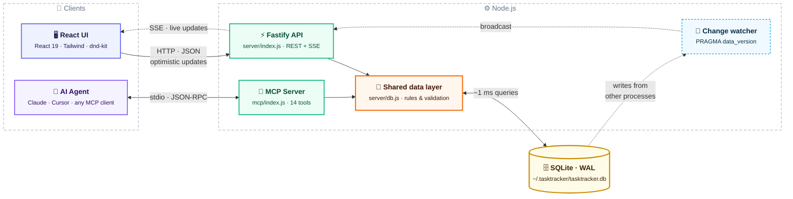
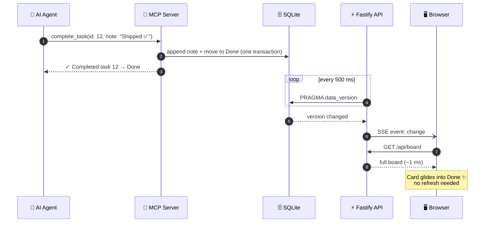

<div align="center">

<picture>
  <source media="(prefers-color-scheme: dark)" srcset="docs/brand/logo-wordmark-dark.svg" />
  
</picture>

<br />

**A calm, beautiful, local-first Kanban board that your AI agent can use too.**

Zero setup. One command. Your data never leaves your machine.

[](https://nodejs.org)
[](https://react.dev)
[](https://nodejs.org/api/sqlite.html)
[](https://modelcontextprotocol.io)
[](LICENSE)
[](CONTRIBUTING.md)

<br />


</div>

<br />

## Why Task Tracker?

Most task apps are either cloud-hosted and heavy, or plain text and bare. Task Tracker sits in between:

- 🧘 **Low cognitive load.** Four columns, one click to open a card, no Save buttons. Everything autosaves.
- ⚡ **Fast.** One SQLite query loads the whole board in about 1 ms, and the UI updates optimistically, so nothing waits on the network.
- 🔌 **Built for agents.** A first-class [MCP](https://modelcontextprotocol.io) server lets Claude, Cursor or any MCP client read, create, move and complete your tasks, and you watch it happen live in the browser.
- 🏠 **Local-first.** Everything lives in one SQLite file on your machine. No account, no cloud, no telemetry.
- 🎨 **Pleasant to look at.** Eleven focus-friendly themes, from warm Paper to neon Terminal.

## Quick start

```bash
git clone https://github.com/Parv17k/tasktracker.git
cd tasktracker
npm install      # installs dependencies and builds the UI
npm start        # → http://localhost:1717
```

That's it. No database to install and no config files. SQLite is built into Node 22.13+, so there's nothing native to compile either.

## Features

<table>
<tr>
<td width="50%" valign="top">

### 📋 A board that adapts to you
- Default columns: **Open → In Progress → Follow-up → Done**
- Add, rename, recolour and reorder columns, and choose which one means "done"
- **Removing a column that still has tasks asks first**: move the tasks somewhere else, or hide the column and bring it back later
- Smooth drag & drop within and across columns

</td>
<td width="50%" valign="top">

### ✍️ Rich, frictionless cards
- Title, description, **subtasks** with a progress bar, and a lined **note** pad
- Priority levels from Low to Urgent
- **Archive** with one click (with Undo), then restore or delete from the archive
- Tick the circle on a card to complete it

</td>
</tr>
<tr>
<td valign="top">

### ⏰ Deadlines that speak human
- Pick a date with an optional time, or use a preset: *Today*, *Tomorrow*, *In 2 days*, *Next week*
- Cards read **Due today**, **Due in 3h**, **Due next week** or **Overdue by 2d**, colour-coded and updated live
- **Due this week** and **Overdue** filters, plus a live count in the header
- A start/pause **time-spent timer** on every task

</td>
<td valign="top">

### ⌨️ Keyboard-friendly quick add
Press <kbd>N</kbd> and type naturally:

```
Send invoice to Acme @fri !high
```

- `@today` `@tomorrow` `@mon`…`@sun` `@nextweek` `@3d` `@2w` `@2026-12-01` set the deadline
- `!low` `!med` `!high` `!urgent` set the priority
- <kbd>/</kbd> to search, <kbd>Esc</kbd> to close

</td>
</tr>
</table>

<div align="center">

<br /><sub>Every field autosaves. The deadline, timer, subtasks and note all live in one calm panel.</sub>
</div>

## 🎨 Themes

Eleven themes designed for focus. Switch instantly from the brush icon in the top bar; your choice is remembered.

| | |
|:-:|:-:|
|  **Old Money**: hunter green, ivory & brass |  **Midnight Ink**: deep navy for late sessions |
|  **Terminal**: neon green on black |  **Sakura**: soft blush, quiet focus |
|  **Bubblegum**: playful pink, soft & rounded |  **Grayscale**: no color, no glare, built for all-day screen time |

Also included: **Paper** · **Nordic Frost** · **Sage Garden** · **Espresso Library** · **Graphite**

## 🤖 Plug in your AI agent (MCP)

Task Tracker ships with a [Model Context Protocol](https://modelcontextprotocol.io) server, so your agent can keep track of its own work, or yours.

**Claude Code**

```bash
claude mcp add tasktracker -- node /absolute/path/to/tasktracker/mcp/index.js
```

**Claude Desktop, Cursor, Windsurf and other MCP clients**

```json
{
  "mcpServers": {
    "tasktracker": {
      "command": "node",
      "args": ["/absolute/path/to/tasktracker/mcp/index.js"]
    }
  }
}
```

Then just ask:

> *"What's overdue on my board?"*
> *"Break task #3 into subtasks and move it to In Progress."*
> *"Log what you just did on #12 and mark it complete."*

<details>
<summary><b>All 14 MCP tools</b></summary>

| Tool | What it does |
| --- | --- |
| `get_board` | Overview of every column and task. A good first call |
| `list_tasks` | Filter by column, text, `due_within_days`, `overdue`, archived |
| `get_task` | Full details, including subtask ids |
| `create_task` | Title, description, note, column, priority, due date, subtasks |
| `update_task` | Change any field (`due: ""` clears the deadline) |
| `move_task` | Move by column name (fuzzy: `"in prog"` works) or id |
| `complete_task` | Move to the done column, optionally appending a summary |
| `archive_task` | Archive, or restore with `archived: false` |
| `append_note` | Add a timestamped line to the note (great for progress logs) |
| `add_subtasks` | Add checklist items |
| `update_subtask` | Check, uncheck or rename a subtask |
| `delete_subtask` | Remove a subtask |
| `track_time` | Start or stop the time-spent timer |
| `list_columns` | Columns with ids, hidden flags and the done column |

</details>

The agent writes straight to the same SQLite file, so the web server doesn't even need to be running. If it is, open tabs **update live** within about half a second.

## 🏗️ How it works



### ⚡ Live sync: an agent completes a task and your board updates



- **One data layer** (`server/db.js`) holds every business rule, shared by the API and the MCP server, so humans and agents always behave the same way.
- **Live sync without polling the API:** the server watches SQLite's `PRAGMA data_version` and pushes changes from other processes to browsers over Server-Sent Events.
- **WAL mode** lets the web app and an agent write at the same time.
- **Optimistic UI** with fractional ordering means drag & drop never waits on the server.

| Layer | Tech |
| --- | --- |
| Frontend | React 19 · Vite · Tailwind CSS v4 · Radix UI · dnd-kit · Zustand · Sonner |
| Backend | Node.js · Fastify · `node:sqlite` |
| Agent | `@modelcontextprotocol/sdk` · Zod |

<details>
<summary><b>Configuration</b></summary>

| Env var | Default | |
| --- | --- | --- |
| `PORT` | `1717` | Web server port |
| `HOST` | `127.0.0.1` | Bound to localhost only by default |
| `TASKTRACKER_DB` | `~/.tasktracker/tasktracker.db` | Shared by the web app and the MCP server |

</details>

<details>
<summary><b>REST API</b></summary>

| Method | Endpoint | |
| --- | --- | --- |
| `GET` | `/api/board` | All columns and active tasks, with subtasks |
| `GET` | `/api/tasks?q=&column=&overdue=&dueWithinDays=&archived=` | Search and filter |
| `POST` | `/api/tasks` | Create |
| `PATCH` | `/api/tasks/:id` | Update fields, archive or restore |
| `POST` | `/api/tasks/:id/move` | `{ columnId, index }` |
| `POST` | `/api/tasks/:id/complete` | Move to the done column |
| `POST` | `/api/tasks/:id/timer/start` · `/stop` | Time tracking |
| `POST` | `/api/tasks/:id/subtasks` | Add a subtask |
| `PATCH` / `DELETE` | `/api/subtasks/:id` | Update or delete a subtask |
| `POST` / `PATCH` / `DELETE` | `/api/columns[/:id]` | Manage columns (`DELETE ?moveTo=<id>`) |
| `GET` | `/api/events` | Server-Sent Events stream |

</details>

## 🛠️ Development

```bash
npm run dev     # API on :1717 + Vite with hot reload on :5173
npm test        # data-layer tests (node:test)
npm run build   # production build of the UI
```

## 🤝 Contributing

**Contributions of every size are welcome**, from fixing a typo to adding a theme or a whole feature. If this is your first open-source contribution, even better: we'd love to help you land it.

1. Read the **[Contributing Guide](CONTRIBUTING.md)**. It takes about 3 minutes.
2. Look for issues labelled [`good first issue`](https://github.com/Parv17k/tasktracker/labels/good%20first%20issue), or pick something from the [ideas list](CONTRIBUTING.md#-ideas-to-get-you-started).
3. Fork, branch, code, and open a pull request.

Not sure where to start? [Open an issue](https://github.com/Parv17k/tasktracker/issues/new/choose) and say hi. 👋

Please follow our [Code of Conduct](CODE_OF_CONDUCT.md) in all interactions.

## ⭐ Support

If Task Tracker helps you stay focused, consider **starring the repo**. It helps others find it.

## License

[MIT](LICENSE) © Parv Khatri
