<div align="center">

<picture>
  <source media="(prefers-color-scheme: dark)" srcset="docs/brand/logo-wordmark-dark.svg" />
  
</picture>

<br />

**A calm, beautiful, local-first Kanban board with AI built in.**

Ask it what matters today. Let your agents manage tasks over MCP. Keep every byte on your machine.

[](https://nodejs.org)
[](https://react.dev)
[](https://nodejs.org/api/sqlite.html)
[](#-ai-built-in)
[](https://modelcontextprotocol.io)
[](#-install-it-and-get-reminders)
[](LICENSE)
[](CONTRIBUTING.md)

<br />

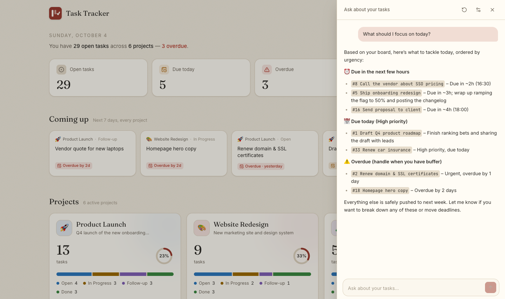

<sub>A real, unedited answer from a self-hosted open model, grounded in the board behind it.</sub>

</div>

<br />

## Why Task Tracker?

Most task apps are either cloud-hosted and heavy, or plain text and bare. Task Tracker sits in between, and it's built for working **with** AI:

- ✨ **Ask your board anything, and let it act with your OK.** "What should I focus on today?" "Move the overdue ones to Friday." The assistant proposes changes and nothing happens until you approve. Bring any OpenAI-compatible model: OpenAI, OpenRouter, Groq, or a local one with Ollama or LM Studio.
- 🤖 **Agents are first-class users.** A built-in [MCP](https://modelcontextprotocol.io) server gives Claude, Cursor and other agents 18 tools to read, create, move, tag and complete tasks, and you watch it happen live.
- 🗂️ **Every project at a glance.** A home page shows each project's tasks by status, what's overdue, and what's coming up across all of them.
- 🧘 **Low cognitive load.** Four columns, one click to open a card, no Save buttons. Everything autosaves.
- ⚡ **Fast.** One SQLite query loads a whole board in about 1 ms, and the UI updates optimistically, so nothing waits on the network.
- 🔔 **Never miss a deadline.** Install it as an app and get system notifications before things are due, even when the window is closed.
- 🏠 **Local-first.** One SQLite file on your machine. No account, no cloud, no telemetry. Pair it with a local model and nothing ever leaves your computer.
- 🎨 **Pleasant to look at.** Twenty-four focus-friendly themes, from warm Paper to neon Terminal.

## Quick start

```bash
git clone https://github.com/Parv17k/tasktracker.git
cd tasktracker
npm install      # installs dependencies and builds the UI
npm start        # → http://localhost:1717
```

That's it. No database to install and no config files. SQLite is built into Node 22.13+, so there's nothing native to compile either.

## ✨ AI, built in

Task Tracker works with AI in two directions: **you ask it about your work**, and **agents do work in it**.

<table>
<tr>
<td width="50%" valign="top">

### 💬 Ask about your tasks

Click ✨ in the top bar and chat with your board.

- **Grounded answers**: every question carries a compact snapshot of your projects, columns and tasks, with due dates, priorities, subtasks and tracked time. The project you have open comes first.
- **Any OpenAI-compatible provider**: one-click presets for OpenAI, OpenRouter, Groq, Ollama and LM Studio, or any base URL. *Load models* lists what's available and tests the connection.
- **Acts with your approval**: ask it to move, reschedule, reprioritise, tag, create or complete tasks, and it shows an approval card. Untick anything you don't want, then **Apply**. Nothing changes until you do.
- **Streams as it thinks**, with a Stop button. The conversation follows you between pages.
- **Clear when something's wrong**: if your provider is down, the key is wrong or the URL is off, you get a plain explanation and a next step, not an error dump.
- **Private by design**: your API key is stored in your local database and sent only to your provider. The browser only ever sees `…last4`.

</td>
<td width="50%" valign="top">

### 🔌 Let agents do the work

A first-class **MCP server** turns Task Tracker into shared memory for your coding agent:

- Agents **plan** in it: break work into tasks and subtasks.
- They **report** in it: append timestamped progress notes.
- They **finish** in it: complete tasks with a summary.
- **Live sync**: their changes appear on your board within about half a second, no refresh needed.
- **Same rules for everyone**: humans and agents go through one shared data layer, so validation and behaviour always match.

</td>
</tr>
</table>

<div align="center">
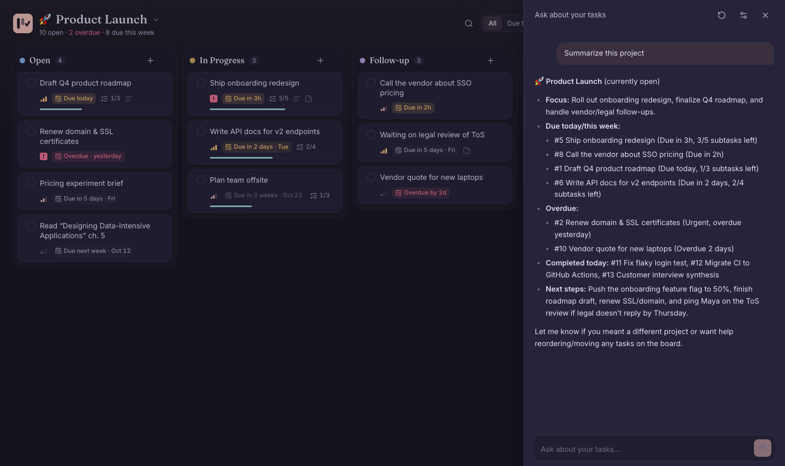
<br /><sub>"Summarize this project", asked from inside a board in the Rosé Pine theme. Also a real answer.</sub>
</div>

<br />

> 🔒 **What leaves your machine?** Only when you ask a question: a summary of your tasks goes to the provider you chose. Point it at Ollama or LM Studio and even that stays local. Changes always need your approval, it can't delete anything (archive is the most it can do), and every change is checked against the same rules as the board.

## 🎯 Features

### 🗂️ Projects and a home page

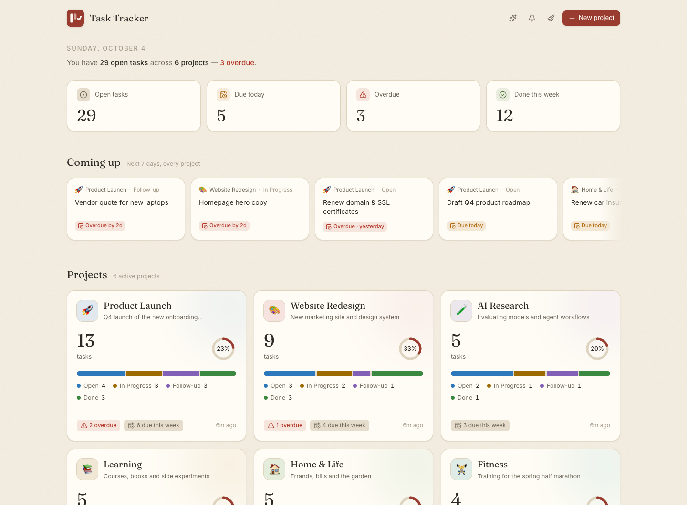

Each project gets its own board. The home page shows them all in a single glance:

- **Totals and status breakdown**: how many tasks, and how many are in Open, In Progress, Follow-up, Done or your own columns
- **Progress ring**, overdue and due-this-week counts, and when the project was last touched
- **Coming up**: everything due in the next 7 days across *all* projects; click a card to open that task
- **Drag projects to reorder them**, and create, edit, archive or delete them. New projects start with the four default columns, or copy another project's
- **Priority and tags on projects**: mark what matters most (Low to Urgent), tag projects (`work`, `personal`, `Q4`…) and filter the home page by tag
- Jump between projects from the switcher in each board's title

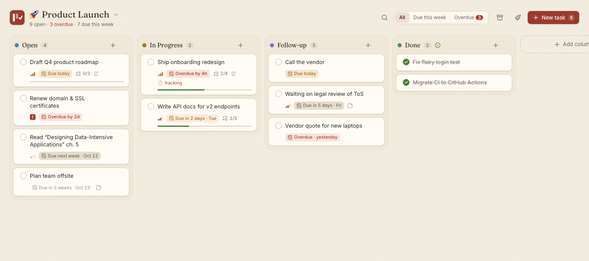

<table>
<tr>
<td width="50%" valign="top">

### 📋 A board that adapts to you
- Default columns: **Open → In Progress → Follow-up → Done**
- Add, rename and recolour columns, **drag them by the header to reorder**, and choose which one means "done"
- **Removing a column that still has tasks asks first**: move the tasks somewhere else, or hide the column and bring it back later
- Smooth drag & drop within and across columns, with clear grab handles

</td>
<td width="50%" valign="top">

### ✍️ Rich, frictionless cards
- Title, description, **subtasks** with a progress bar, and a lined **note** pad
- Priority levels from Low to Urgent
- **Tags** in colour: type `#design` when adding a task or pick from suggestions, click any tag to filter the board, and rename, recolour or delete tags in one place
- **Archive** with one click (with Undo), then restore or delete from the archive
- Tick the circle on a card to complete it
- **Search** finds text in any field: title, description, note, subtasks and tags

</td>
</tr>
<tr>
<td valign="top">

### ⏰ Deadlines that speak human
- Pick a date with an optional time, or use a preset: *Today*, *Tomorrow*, *In 2 days*, *Next week*
- Cards read **Due today**, **Due in 3h**, **Due next week** or **Overdue by 2d**, colour-coded and updated live
- **Due this week** and **Overdue** filters, plus a live count in the header
- A start/pause **time-spent timer** on every task

</td>
<td valign="top">

### ⌨️ Keyboard-friendly quick add
Press <kbd>N</kbd> and type naturally:

```
Send invoice to Acme @fri !high #finance
```

- `@today` `@tomorrow` `@mon`…`@sun` `@nextweek` `@3d` `@2w` `@2026-12-01` set the deadline
- `!low` `!med` `!high` `!urgent` set the priority
- `#finance` `#q4-launch` add tags
- <kbd>/</kbd> to search, <kbd>Esc</kbd> to close

</td>
</tr>
</table>

<div align="center">
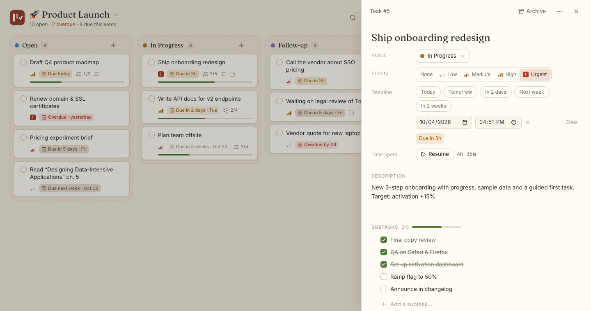
<br /><sub>Every field autosaves. The deadline, timer, subtasks and note all live in one calm panel.</sub>
</div>

### 📲 Install it, and get reminders

Task Tracker is a **Progressive Web App**: click **Install** in the top bar (Chrome, Edge, or Safari's *Add to Dock*) and it gets its own window and Dock/taskbar icon.

Turn on reminders from the 🔔 bell, and Task Tracker sends system notifications for deadlines:

| Reminder | When | Adjustable |
| --- | --- | --- |
| The day before | at your morning time (default 9:00) | on/off, time |
| The morning it's due | at your morning time | on/off |
| Before a due time | for tasks with a time, e.g. 1 hour before | on/off, 15 min to 1 day |
| When it becomes overdue | at the due time, or the next morning for all-day tasks | on/off |

- **Works with the app closed**: the local server sends reminders through the browser's push service, signed with keys generated on your machine. No account is needed.
- **Calm by design**: each reminder fires once, done tasks never remind you, and a burst of reminders (say, after your laptop wakes up) arrives as a single summary.
- **Click a notification** to jump straight to that task.

> Reminders while the app is closed need the Task Tracker server running. Delivery goes through your browser's push service, so it needs an internet connection. Open windows also receive reminders over the local live-update stream.

## 🎨 Themes

Twenty-four themes designed for focus. Switch instantly from the brush icon in the top bar; your choice applies everywhere and is remembered.

| | | |
|:-:|:-:|:-:|
| 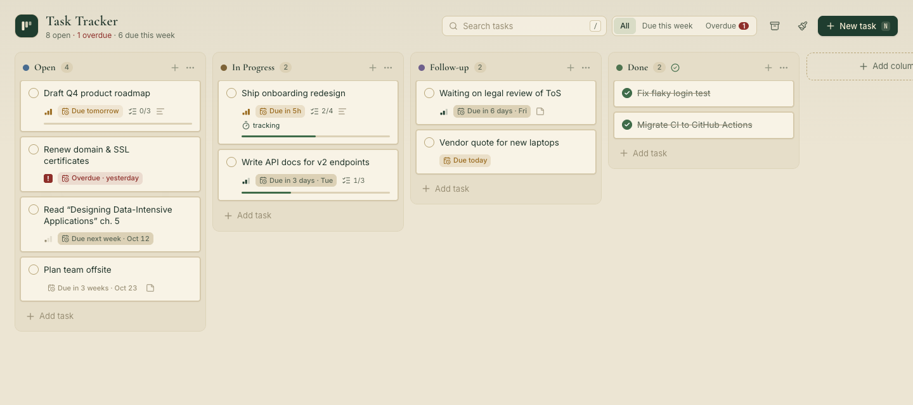<br/>**Old Money** · hunter green & brass | 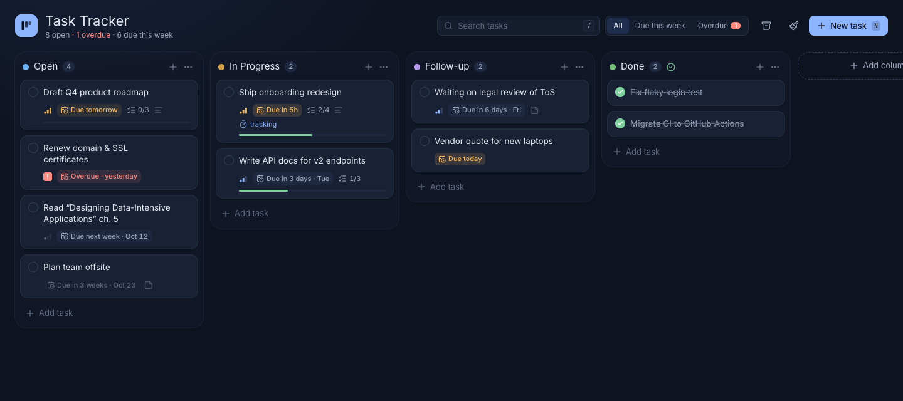<br/>**Midnight Ink** · deep navy | 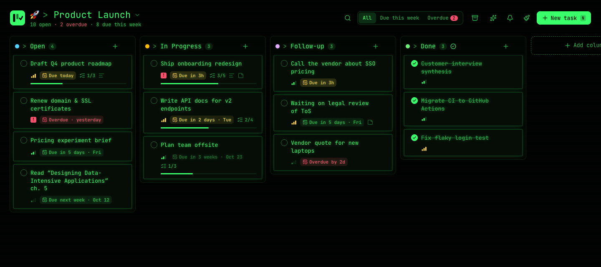<br/>**Terminal** · neon green on black |
| 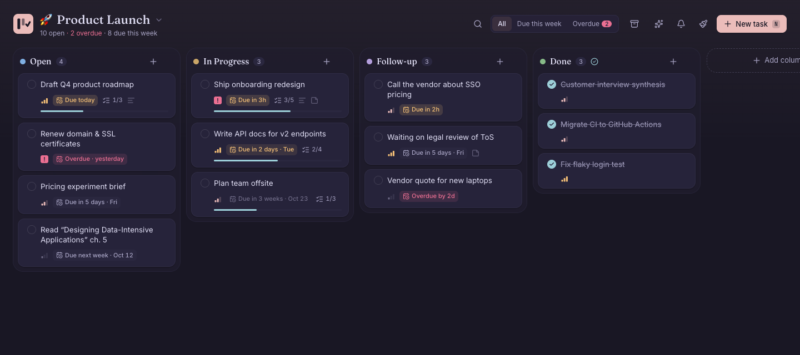<br/>**Rosé Pine** · soft rose on midnight | 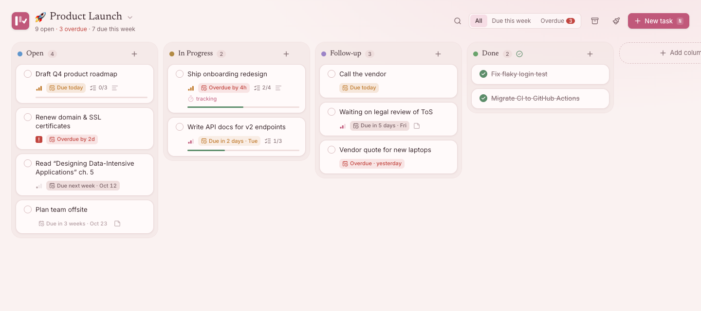<br/>**Sakura** · soft blush | 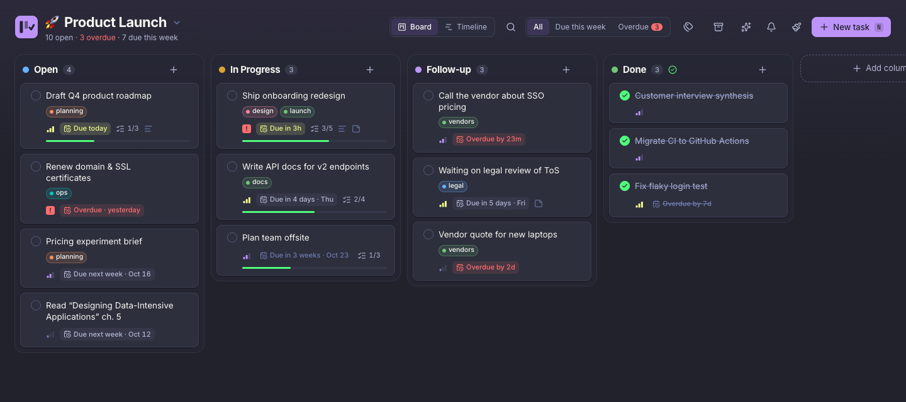<br/>**Dracula** · purple after dark |
| 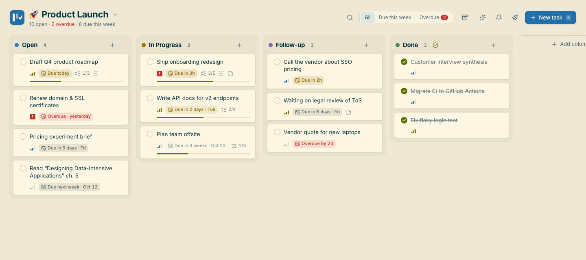<br/>**Solarized** · precise and warm | 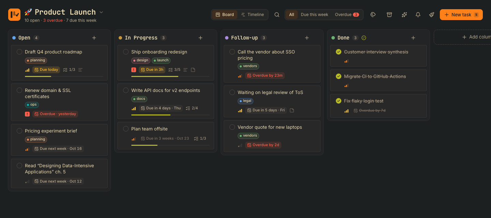<br/>**Gruvbox** · retro and earthy | 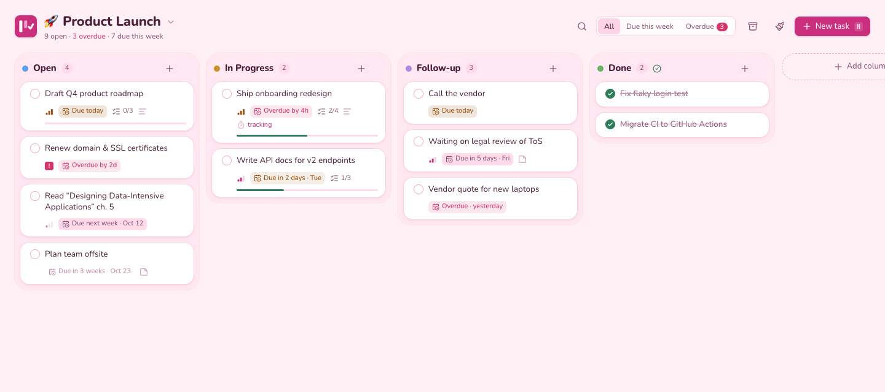<br/>**Bubblegum** · playful pink |
| 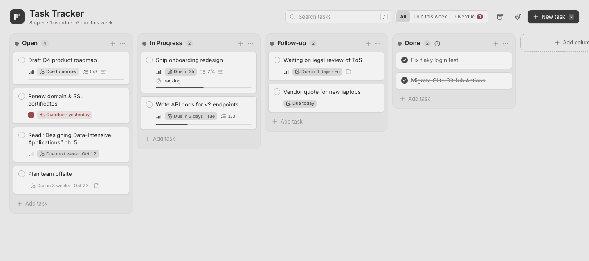<br/>**Grayscale** · no colour, no glare | 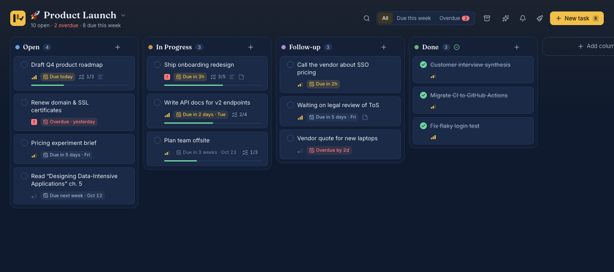<br/>**Navy & Gold** · golden highlights | 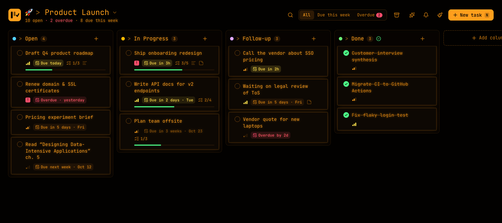<br/>**Neon Orange** · glowing amber |

Also included: **Paper** · **New York** · **Nordic Frost** · **Sage Garden** · **Espresso Library** · **Graphite** · **Grayscale Dark** · **Crimson** · **Ivy** · **Cardinal** · **Sunset Orange** · **Harbor Gold**

## 🤖 Plug in your AI agent (MCP)

Task Tracker ships with a [Model Context Protocol](https://modelcontextprotocol.io) server, so your agent can keep track of its own work, or yours.

**Claude Code**

```bash
claude mcp add tasktracker -- node /absolute/path/to/tasktracker/mcp/index.js
```

**Claude Desktop, Cursor, Windsurf and other MCP clients**

```json
{
  "mcpServers": {
    "tasktracker": {
      "command": "node",
      "args": ["/absolute/path/to/tasktracker/mcp/index.js"]
    }
  }
}
```

Then just ask:

> *"What's overdue across all my projects?"*
> *"Break task #3 into subtasks and move it to In Progress."*
> *"Log what you just did on #12 and mark it complete."*

<details>
<summary><b>All 18 MCP tools</b></summary>

| Tool | What it does |
| --- | --- |
| `list_projects` | Every project with task counts per column and deadlines. A good first call |
| `create_project` | New project with its own board, priority and tags |
| `update_project` | Rename, re-icon, set priority, or add/remove tags |
| `get_board` | Columns and tasks of one project (`project: "website"`, fuzzy) |
| `list_tasks` | Search across all projects or one: column, text, `tag`, `due_within_days`, `overdue`, archived |
| `get_task` | Full details, including subtask ids |
| `create_task` | Project, column, title, description, note, priority, due date, subtasks, tags |
| `update_task` | Change any field (`due: ""` clears the deadline), `add_tags` / `remove_tags` |
| `move_task` | Move by column name (fuzzy: `"in prog"` works) or id |
| `complete_task` | Move to the done column, optionally appending a summary |
| `archive_task` | Archive, or restore with `archived: false` |
| `append_note` | Add a timestamped line to the note (great for progress logs) |
| `add_subtasks` | Add checklist items |
| `update_subtask` | Check, uncheck or rename a subtask |
| `delete_subtask` | Remove a subtask |
| `track_time` | Start or stop the time-spent timer |
| `list_columns` | A project's columns with ids, hidden flags and the done column |
| `list_tags` | Every tag with how many tasks and projects use it |

</details>

The agent writes straight to the same SQLite file, so the web server doesn't even need to be running. If it is, open tabs **update live** within about half a second.

## 🏗️ How it works

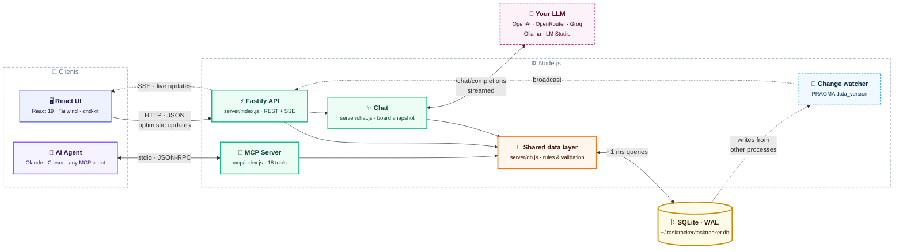

### ✨ Ask: from your question to an answer, and changes you approve

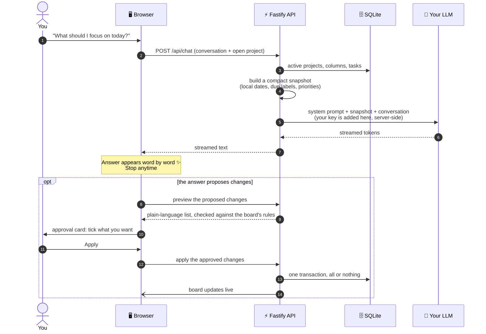

### ⚡ Live sync: an agent completes a task and your board updates

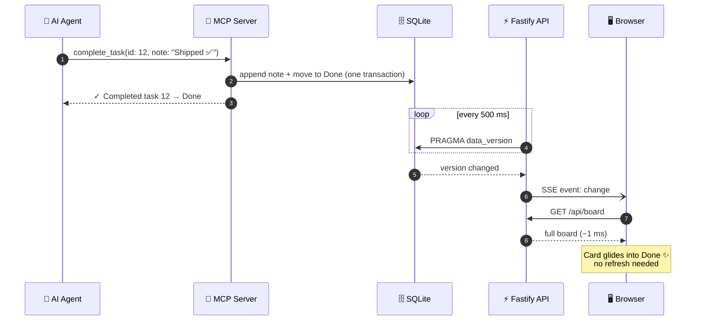

### 🔔 Reminders: from a deadline to your screen

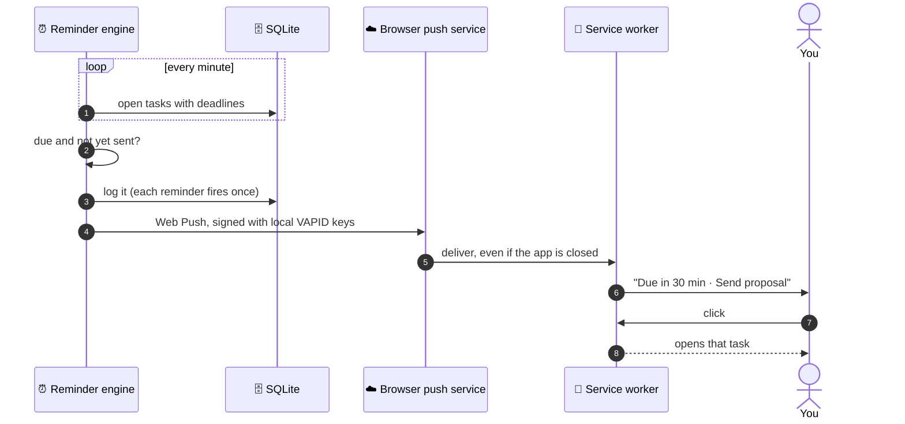

- **One data layer** (`server/db.js`) holds every business rule, shared by the API, the chat and the MCP server, so humans and agents always behave the same way.
- **Grounded chat without tool calling:** the server sends the model a compact, budgeted snapshot of your board, so even small local models give useful answers. Your API key never reaches the browser.
- **Live sync without polling the API:** the server watches SQLite's `PRAGMA data_version` and pushes changes from other processes to browsers over Server-Sent Events.
- **WAL mode** lets the web app and an agent write at the same time.
- **Optimistic UI** with fractional ordering means drag & drop never waits on the server.

| Layer | Tech |
| --- | --- |
| Frontend | React 19 · Vite · Tailwind CSS v4 · Radix UI · dnd-kit · Zustand · Sonner |
| Backend | Node.js · Fastify · `node:sqlite` · `web-push` |
| AI | Any OpenAI-compatible `/chat/completions` API (streaming) · `@modelcontextprotocol/sdk` · Zod |
| App | Web App Manifest · Service Worker · Push & Notifications APIs |

<details>
<summary><b>Configuration</b></summary>

| Env var | Default | |
| --- | --- | --- |
| `PORT` | `1717` | Web server port |
| `HOST` | `127.0.0.1` | Bound to localhost only by default |
| `TASKTRACKER_DB` | `~/.tasktracker/tasktracker.db` | Shared by the web app and the MCP server |

The AI chat provider is configured in the app (✨ → settings) and stored in the same database.

</details>

<details>
<summary><b>REST API</b></summary>

| Method | Endpoint | |
| --- | --- | --- |
| `GET` | `/api/home` | Every project with stats, plus tasks due soon across projects |
| `GET` / `POST` | `/api/projects` | List or create projects |
| `GET` | `/api/projects/:id/board` | A project's columns and active tasks, with subtasks |
| `PATCH` / `DELETE` | `/api/projects/:id` | Edit, archive or delete a project |
| `POST` | `/api/projects/:id/move` | `{ index }` to reorder |
| `GET` | `/api/tasks?project=&q=&tag=&column=&overdue=&dueWithinDays=&archived=` | Search and filter |
| `POST` | `/api/tasks` | Create |
| `PATCH` | `/api/tasks/:id` | Update fields, archive or restore |
| `POST` | `/api/tasks/:id/move` | `{ columnId, index }` |
| `POST` | `/api/tasks/:id/complete` | Move to the done column |
| `POST` | `/api/tasks/:id/timer/start` · `/stop` | Time tracking |
| `POST` | `/api/tasks/:id/subtasks` | Add a subtask |
| `PATCH` / `DELETE` | `/api/subtasks/:id` | Update or delete a subtask |
| `POST` / `PATCH` / `DELETE` | `/api/columns[/:id]` | Manage columns (`POST { projectId, … }`, `DELETE ?moveTo=<id>`) |
| `GET` / `PATCH` | `/api/settings/reminders` | Reminder preferences |
| `GET` | `/api/push/key` | Public VAPID key for subscribing |
| `POST` | `/api/push/subscribe` · `/unsubscribe` | Register or remove a browser for push |
| `POST` | `/api/push/test` | Send a test notification |
| `GET` / `PATCH` | `/api/settings/llm` | Chat provider (base URL, model, key). The key is write-only |
| `GET` | `/api/chat/models` | Models offered by the provider (also a connection test) |
| `POST` | `/api/chat` | `{ messages, projectId }`, streams the reply as plain text |
| `GET` | `/api/tags` | Every tag with its colour and usage counts |
| `PATCH` / `DELETE` | `/api/tags/:id` | Rename or recolour a tag everywhere, or delete it |
| `GET` | `/api/events` | Server-Sent Events stream (`change`, `reminder`) |

</details>

## 🧭 Roadmap

Task Tracker is young and moving fast. Here's where it's heading, and **every item is open for contributors**. Comment on an issue (or open one) to claim it.

### ✅ Recently shipped
- ✨ AI chat with any OpenAI-compatible provider, grounded in your board
- ✅ The assistant can change your board, with an approval card for every change
- 🏷️ Tags on tasks and projects, and project priority
- 🗂️ Multiple projects with a home page, drag-to-reorder projects and columns
- 📲 Installable app with deadline reminders that work while it's closed
- 🎨 Twenty-four themes

### 🤖 AI and agents

| Idea | What it means | Status |
| --- | --- | --- |
| **Planning agent** | The chat becomes an agent that manages your timeline: proposes deadlines, rebalances priorities when things slip, and breaks goals into tasks. Every change shows as a diff you approve with one click | 🧪 Designing |
| **Undo for applied changes** | One click to roll back everything the assistant just applied | 🙋 Help wanted |
| **Native tool calling** | Use the provider's function calling when it's available, with the current approval card as the fallback | 🙋 Help wanted |
| **Daily briefing** | A morning note: what's due, what's at risk, and a suggested plan for the day, delivered as a notification | 📋 Planned |
| **Weekly review** | What you finished, what slipped, and where your time went, from the timer data | 📋 Planned |
| **Natural-language capture** | Type "remind me to renew insurance next Friday, high priority" and get a fully filled task | 🙋 Help wanted |
| **Risk radar** | Flags tasks likely to slip, based on deadlines, progress on subtasks, and how long similar tasks took | 🧪 Exploring |
| **Semantic search** | Find tasks by meaning, using local embeddings, so it still works offline | 🧪 Exploring |
| **Voice capture** | Speak a task, transcribe it with a local Whisper model, and file it | 🙋 Help wanted |
| **Remote MCP** | Streamable-HTTP transport, so agents on other machines can connect | 🙋 Help wanted |

### 📋 Planning and productivity

| Idea | Status |
| --- | --- |
| 🎯 **Goals**: link tasks to longer-term goals and track progress toward them | 📋 Planned |
| 🔁 **Recurring tasks**: daily, weekly, monthly, or custom | 🙋 Help wanted |
| 💾 **Saved filters**: keep a tag + deadline + search combination one click away | 🙋 Help wanted |
| 🗓️ **Calendar and timeline views** of deadlines across projects | 📋 Planned |
| 🔗 **Task dependencies**: "blocked by #12" | 🧪 Exploring |
| 🍅 **Focus mode**: one task, a Pomodoro timer, everything else hidden | 🙋 Help wanted |
| 📄 **Task templates** for repeatable checklists | 🙋 Help wanted |
| 🔀 **Move tasks between projects** | 🙋 Help wanted |

### 🔄 Data and platforms

| Idea | Status |
| --- | --- |
| 📥 **Import** from Trello, Todoist and GitHub Issues | 🙋 Help wanted |
| 📤 **Export** a board as Markdown or JSON, and one-click backups | 🙋 Help wanted |
| 📱 **Phone access** on your local network with HTTPS, so phones can install the app too | 🧪 Exploring |
| 🔄 **Optional sync** between your own devices, still with no cloud account | 🧪 Exploring |
| ⌨️ **Command palette** (<kbd>⌘K</kbd>) and a keyboard shortcuts sheet (<kbd>?</kbd>) | 🙋 Help wanted |
| 🌍 **Translations** and an accessibility audit | 🙋 Help wanted |

<sub>🧪 Exploring: open design question · 📋 Planned: agreed direction · 🙋 Help wanted: ready to pick up</sub>

## 🛠️ Development

```bash
npm run dev     # API on :1717 + Vite with hot reload on :5173
npm test        # data layer, reminder and chat tests (node:test)
npm run build   # production build of the UI
```

## 🤝 Contributing

**Contributions of every size are welcome**, from fixing a typo to adding a theme or building the planning agent. If this is your first open-source contribution, even better: we'd love to help you land it.

1. Read the **[Contributing Guide](CONTRIBUTING.md)**. It takes about 3 minutes.
2. Pick something from the [roadmap](#-roadmap), look for issues labelled [`good first issue`](https://github.com/Parv17k/tasktracker/labels/good%20first%20issue), or browse the [ideas list](CONTRIBUTING.md#-ideas-to-get-you-started).
3. Fork, branch, code, and open a pull request.

Not sure where to start? [Open an issue](https://github.com/Parv17k/tasktracker/issues/new/choose) and say hi. 👋

Please be kind, be patient, and assume good intent.

## ⭐ Support

If Task Tracker helps you stay focused, consider **starring the repo**. It helps others find it.

## License

[MIT](LICENSE) © Parv Khatri
